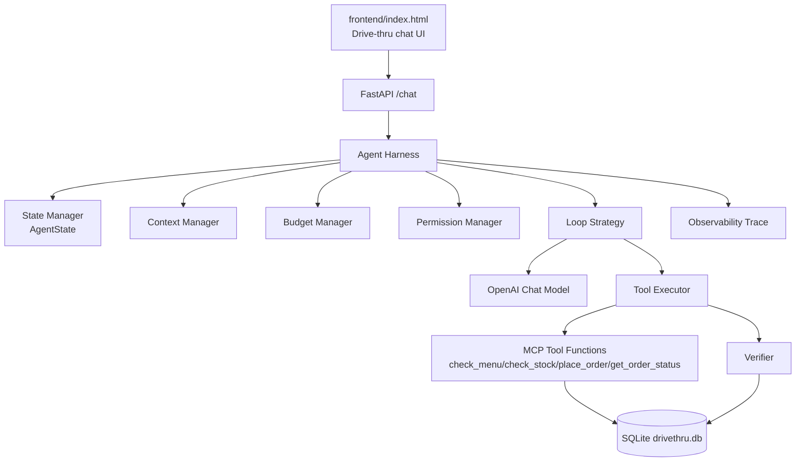

# Warung Cepat DriveThru


MCP-based Agent Harness and Loop Engineering experiment for a fast-food drive-thru ordering flow.

The original app is preserved: a browser chat UI talks to a FastAPI backend, the backend uses an LLM with tool calling, and the tools operate on a SQLite menu/order database. The implementation now routes LLM decisions through an explicit harness that controls state, permissions, budgets, tool execution, verification, retries, and tracing.

## Architecture



## Project Structure

```text
backend/
  main.py                 FastAPI API layer
  database.py             SQLite schema and seed data
  mcp_server.py           FastMCP server and domain tools
  benchmark.py            Loop strategy benchmark command
  agent/
    config.py             Tool schemas, system prompt, runtime settings
    state.py              AgentState, ToolCall, observations, verification, trace
    components.py         Context, state, tool, permission, budget, verifier, observability
    strategies.py         Basic, Plan First, Verify + Repair loops
    harness.py            AgentHarness entry point
    evaluation.py         Deterministic benchmark scenarios and fake model
frontend/
  index.html              Existing drive-thru browser client
tests/
  test_agent_harness.py   Deterministic harness tests using mocked model decisions
```

## Agent Harness

The harness is the runtime controller. The LLM can request tools, but it does not directly execute them. Every run tracks:

- `task_id`
- `user_goal`
- `status`
- `iteration`
- `messages`
- `plan`
- `tool_calls`
- `observations`
- `errors`
- `verification_results`
- `final_result`
- structured trace events

The API now does this:

```python
result = await harness.run(task)
```

instead of owning the tool-calling loop inside the endpoint.

## Agent Loop

Each strategy shares the same harness infrastructure and changes only the loop behavior.

| Strategy | Behavior |
| --- | --- |
| `basic` | Reason, act, observe, repeat until final response or budget stop |
| `plan_first` | Create a plan first, then execute/observe with the shared runtime |
| `verify_repair` | Act, verify important actions, repair/replan on failed observations |

Use a specific strategy by passing it to `/chat`:

```json
{
  "messages": [{"role": "user", "content": "Mau 1 Burger Klasik"}],
  "customer_name": "Budi",
  "strategy": "verify_repair"
}
```

## MCP Tools

MCP remains the tool boundary. The harness executes the existing tool functions from `backend/mcp_server.py`:

- `check_menu`
- `check_stock`
- `place_order`
- `get_order_status`

## Deterministic Verification

The harness does not trust the model's text when a side effect matters.

For `place_order`, the verifier checks SQLite after the tool returns:

- order code exists
- order status is valid
- total and item evidence can be read from the database

Verification produces structured data:

```json
{
  "passed": true,
  "reason": "order exists in database with valid status",
  "evidence": {
    "order_code": "DT-ABC123",
    "status": "processing"
  }
}
```

## Permissions and Human Approval

All tool calls pass through `PermissionManager`.

Read-only tools are allowed:

- `check_menu`
- `check_stock`
- `get_order_status`

`place_order` can require human approval by setting:

```powershell
$env:AGENT_REQUIRE_ORDER_APPROVAL="1"
```

When approval is required and not provided, the run stops as:

```text
WAITING_FOR_APPROVAL
```

The API supports approvals through the `approvals` field:

```json
{
  "messages": [{"role": "user", "content": "Mau 1 Burger Klasik"}],
  "customer_name": "Budi",
  "strategy": "verify_repair",
  "approvals": ["place_order"]
}
```

## Budgets and Circuit Breakers

Runtime limits are configurable:

| Environment Variable | Default |
| --- | --- |
| `AGENT_MAX_ITERATIONS` | `10` |
| `AGENT_MAX_TOOL_CALLS` | `12` |
| `AGENT_MAX_RETRIES` | `2` |
| `AGENT_TOOL_TIMEOUT_SECONDS` | `5` |
| `AGENT_LOOP_STRATEGY` | `verify_repair` |
| `DRIVETHRU_MODEL` | `gpt-4o` |

When a limit is reached, the harness stops with a structured failure result. There are no uncontrolled loops.

## Observability

Each run returns a structured `trace` object alongside the existing frontend fields:

```json
{
  "reply": "...",
  "order_info": {...},
  "task_id": "abc123",
  "agent_status": "completed",
  "stopping_reason": "model returned final response",
  "trace": {
    "iterations": 2,
    "tool_calls": 1,
    "verification_failures": 0,
    "latency_ms": 240.3,
    "events": []
  }
}
```

Secrets such as API keys, tokens, passwords, and secret fields are redacted from trace events.

## Run the App

From the repository root:

```powershell
.\venv\Scripts\Activate.ps1
pip install fastmcp fastapi uvicorn openai python-dotenv
```

Set the API key:

```powershell
$env:OPENAI_API_KEY="your-key-here"
```

Start the backend:

```powershell
cd backend
python main.py
```

Open:

```text
frontend/index.html
```

Health check:

```powershell
Invoke-RestMethod http://localhost:8000/health
```

## Run Tests

Tests use mocked model decisions and do not call OpenAI:

```powershell
python -m unittest discover -s tests -v
```

Latest local run:

```text
Ran 9 tests in 3.765s
OK
```

## Run Benchmark

```powershell
python backend\benchmark.py
```

The benchmark runs ten deterministic scenarios against each loop strategy:

1. Successful order
2. Item unavailable
3. Insufficient stock
4. Invalid tool arguments
5. Tool failure
6. Tool timeout
7. Verification failure
8. User changes request
9. Iteration limit reached
10. Permission denied / approval required

Latest measured summary from this machine:

```text
Strategy       Success  Avg Steps  Avg Tools  Retries  Verification Failures  Latency ms
-------------  -------  ---------  ---------  -------  ---------------------  ----------
basic          10/10    1.9        1.0        4        0                      8.46
plan_first     10/10    1.9        1.0        4        0                      7.32
verify_repair  10/10    1.9        1.0        5        3                      6.24
```

`Success` means the scenario reached its expected controlled outcome. For example, the permission scenario is successful when it stops as `waiting_for_approval`, not when it bypasses approval.

## Known Limitations

- The benchmark uses deterministic fake model decisions, so it measures harness behavior, not real model quality.
- The frontend does not yet include a full human approval UI; approval support exists at the API/harness layer.
- SQLite is still a simple local store. It is fine for the demo, but not a production concurrency model.
- `backend/drivethru.db` is currently tracked in Git, so local orders can create noisy working-tree changes.

## Recommended Next Steps

1. Add a frontend approval confirmation flow for `WAITING_FOR_APPROVAL`.
2. Move `backend/drivethru.db` out of Git tracking and let `database.py` seed local databases.
3. Add dashboard/Kitchen Display System views that consume harness traces and order status.
4. Add status mutation endpoints and realtime order updates.
